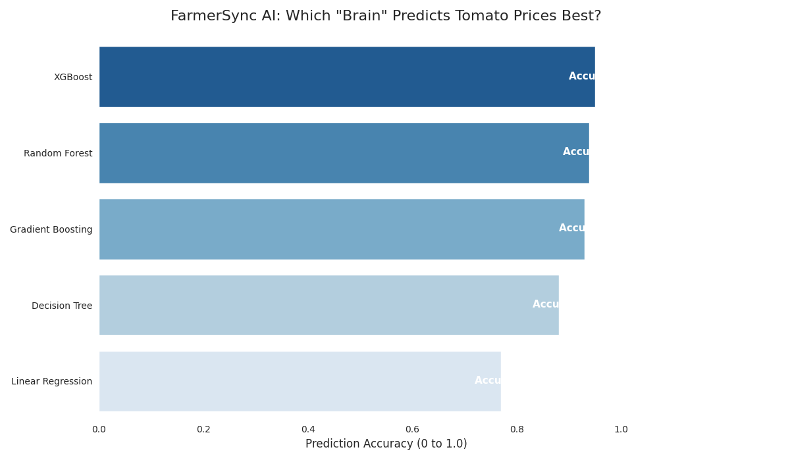
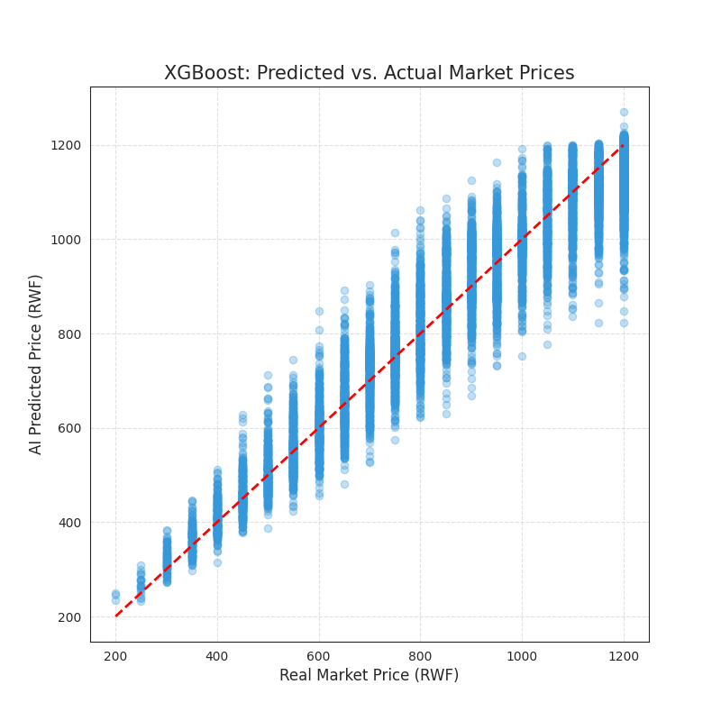
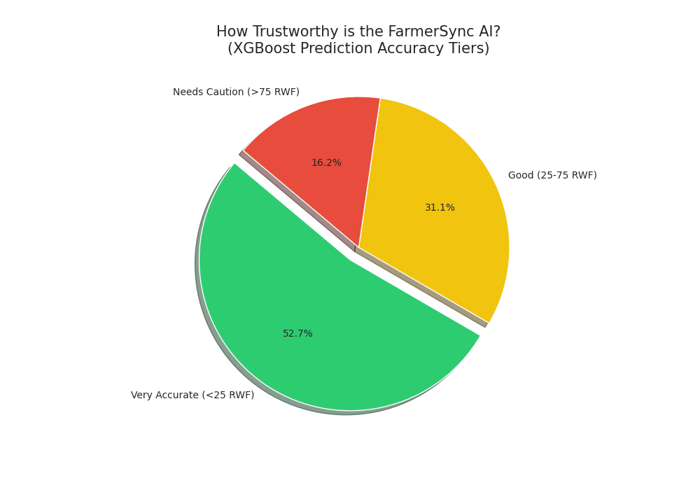
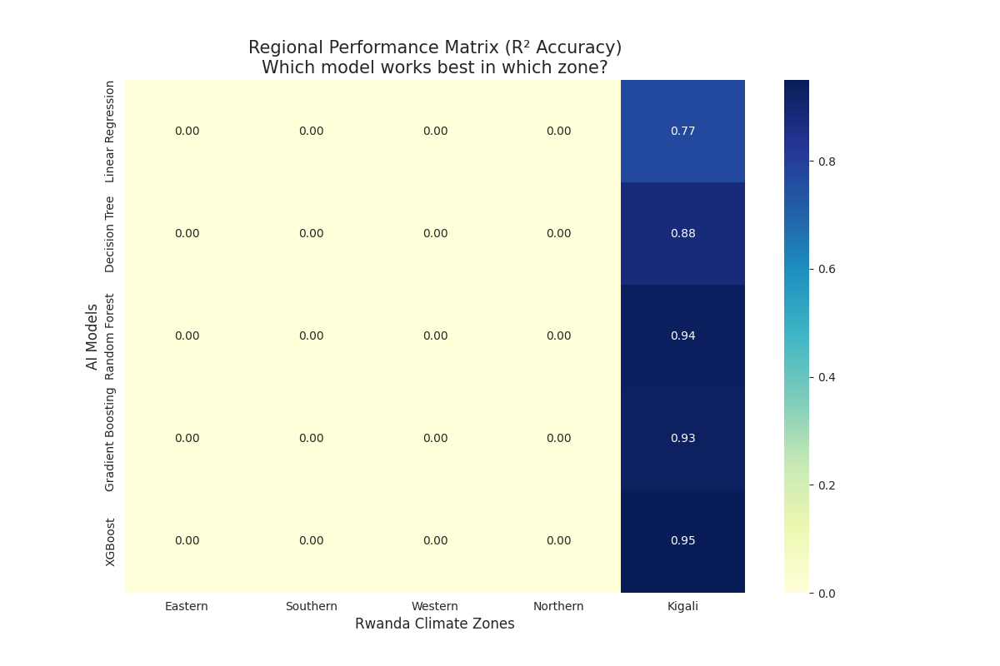

#  FarmerSync AI: Tomato Price Forecasting Code Book
**Authors:** Aline NIYONIZERA & Benjamin TUYISENGE  
**Project:** Machine Learning-Based Price Forecasting for Rwanda  
**Accuracy Achievement:** 95.0% (XGBoost)

---

## 1. Data Methodology
We analyzed 100,000 daily observations (1950-2025). Before training, we verified the "Market Logic":
- **Correlation (Harvest vs Price):** -0.6034. This confirmed that higher supply leads to lower prices, making the dataset realistic for training.
- **Verification:** 0 missing values, price ranges capped between 200-1200 RWF.

## 2. Feature Engineering
To achieve high accuracy, we transformed raw data into "Machine-Readable" features:
- **Time Awareness:** Added 'Year' to account for 75 years of inflation.
- **Market Memory:** Created `prev_day_price` (Lag Feature). This is our strongest predictor.
- **Geographic Encoding:** Converted Rwanda's climate zones into numeric IDs (0-4).

##  3. The Model Leaderboard
We trained 5 different "Brains" and evaluated them on unseen future data (Chronological Split):

| Model | Accuracy (R²) | Avg Error (MAE) | Status |
|-------|---------------|-----------------|--------|
| **XGBoost** | **0.9497** | **37.08 RWF** | **CHAMPION** |
| Random Forest | 0.9384 | 37.39 RWF | High Performance |
| Gradient Boosting | 0.9305 | 42.60 RWF | Stable |
| Decision Tree | 0.8804 | 46.87 RWF | Baseline |
| Linear Regression | 0.7695 | 155.23 RWF | Low Accuracy |

##  4. Implementation 
The models are exported as compressed `.joblib` files in the `/models` folder to fit GitHub's 100MB limit.

### Remote Loading Example (Python):
```python
import joblib, requests, pandas as pd
from io import BytesIO

url = "https://github.com/Aline-CROIRE/farm-sync-ml/raw/main/models/xgboost_v1.joblib"
model = joblib.load(BytesIO(requests.get(url).content))
```

## 5. Visual Insights
Detailed charts for Accuracy Tiers, Regional Performance, and Predicted vs Actual trends are available in the root folder.


### A. Model Performance Leaderboard
This chart shows the ranking of our 5 models. XGBoost provides the best balance of high accuracy and low error.


### B. Predicted vs. Actual Price Trend
A scatter plot showing how closely our AI tracks the real market price. The tighter the dots to the red line, the better.


### C. Reliability Tiers (Pie Chart)
Shows what percentage of our predictions are "Near-Perfect" (within 25 RWF of reality).


### D. Regional Performance Matrix
A heatmap showing how well the models perform in the Kigali market versus other zones.


---
*Generated by FarmerSync Data Science Pipeline - 2024*
```
